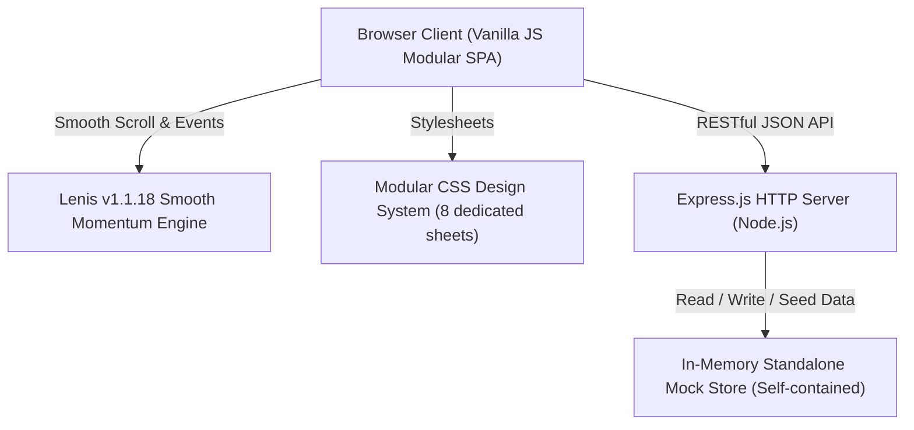

# Find My PKL 🎓 — SMK Taruna Bangsa Kota Bekasi

<p align="center">
  
</p>

<p align="center">
  <strong>Platform Terpadu Tata Kelola, Penelusuran, dan Manajemen Praktik Kerja Lapangan (PKL)</strong><br>
  <em>Menghubungkan Siswa SMK Taruna Bangsa Kota Bekasi, BKK & HUBIN Sekolah, dan Dunia Usaha & Dunia Industri (DUDI)</em>
</p>

<p align="center">
  
  
  
  
  
  
</p>

---

## 📖 Daftar Isi
- [Tentang Platform](#-tentang-platform)
- [Fitur Utama](#-fitur-utama)
  - [1. Portal Publik & Siswa](#1-portal-publik--siswa)
  - [2. Portal BKK & HUBIN (Admin Sekolah)](#2-portal-bkk--hubin-admin-sekolah)
  - [3. Desain & Antarmuka Modern](#3-desain--antarmuka-modern)
- [Arsitektur & Teknologi](#-arsitektur--teknologi)
- [Struktur Direktori](#-struktur-direktori)
- [Panduan Instalasi & Menjalankan](#-panduan-instalasi--menjalankan)
- [Akun Demo & Simulasi Peran](#-akun-demo--simulasi-peran)
- [Dokumentasi REST API](#-dokumentasi-rest-api)
- [Kontribusi & Lisensi](#-kontribusi--lisensi)

---

## 🏫 Tentang Platform

**Find My PKL** adalah sistem informasi digital resmi yang dibangun khusus untuk memfasilitasi seluruh siklus pelaksanaan Praktik Kerja Lapangan (PKL) bagi siswa-siswi **SMK Taruna Bangsa Kota Bekasi**.

Platform ini menyelesaikan kendala konvensional dalam pengelolaan PKL seperti pencarian tempat magang yang tidak terverifikasi, proses administrasi surat pengantar berbasis kertas, lambatnya validasi berkas NISN, serta sulitnya monitoring jurnal kegiatan harian dan rekam jejak alumni.

---

## ✨ Fitur Utama

### 1. Portal Publik & Siswa
* **Beranda Interaktif (Landing Page)**:
  - Hero section fullscreen 100vh berlatar gedung SMK Taruna Bangsa dengan tipografi putih kontras tinggi.
  - *Unified Search Bar* terapung 3 segmen: posisi, jurusan SMK, dan kota penempatan.
  - Strip mitra industri resmi terpercaya dengan logo asli SVG (Telkom, Astra, GoTo, Honda AHM, Mandiri, Paragon).
  - Carousel rekomendasi lowongan PKL: pada desktop berupa grid rapi, pada layar ponsel berubah otomatis menjadi *horizontal swipe carousel* dengan tombol panah navigasi dan indikator titik paginasi.
  - Ulasan dan testimoni autentik alumni per kejuruan.
  - FAQ interaktif seputar pelaksanaan PKL.
* **Katalog Lowongan PKL (Marketplace)**:
  - Tampilan awal bersih dan netral (*clean default*) menampilkan seluruh lowongan terbuka tanpa filter terpasang di awal.
  - Pencarian kata kunci dinamis berbasis tag chips yang dapat ditambah dan dihapus.
  - Multi-filter kategori: Jurusan (RPL, TKJ, DKV, AKL, TKRO), Sistem Kerja (WFO, Hybrid, WFH), Kompensasi (Paid/Unpaid, Sertifikat, Laptop, Uang Makan), dan Durasi Magang (3, 6, 12 bulan).
  - Bottom sheet filter responsif khusus mobile lengkap dengan badge hitung filter aktif.
* **Kartu Lowongan Terstandarisasi**:
  - Logo perusahaan berdimensi proporsional dalam wadah membulat dengan fallback SVG aman.
  - Status kompensasi gaji (*Paid* hijau / *Unpaid* netral) dan tombol bookmark instan.
  - Indikator lencana hijau centang **Mitra DUDI Terverifikasi**.
  - Estimasi jarak dan area penempatan (misal: `2.7km · Duren Sawit`).
  - Tag keahlian, durasi, dan fasilitas (misal: `3 bln`, `SMK`, `RPL`, `Makan Gratis`).
* **Registrasi & Verifikasi Akun Siswa**:
  - Formulir wizard 3 langkah terstruktur dengan validasi NISN Dapodik dan jurusan.
  - Banner status akun informatif (*Menunggu Verifikasi*, *Terverifikasi*, *Perlu Perbaikan*, *Ditolak*).
* **Pelacak Lamaran (Application Tracker)**:
  - Timeline interaktif 5 tahap: *Lamaran Terkirim* &rarr; *Verifikasi BKK/HUBIN* &rarr; *Penerbitan Surat Pengantar Resmi* &rarr; *Seleksi Industri* &rarr; *Diterima / Aktif PKL*.
* **Logbook Jurnal Harian & Tempat PKL Aktif**:
  - Informasi penempatan aktif, Guru Pembimbing, dan Mentor Industri.
  - Hitung mundur durasi magang dan persentase kehadiran.
  - Pengisian logbook kegiatan harian dengan status validasi pembimbing.
* **Favorit & Ulasan Perusahaan**:
  - Penyimpanan lowongan tersimpan (bookmark) berbasis akun dan sesi.
  - Modul pembacaan dan pengiriman ulasan tempat PKL beserta skor bintang dan catatan kelebihan/kekurangan.

---

### 2. Portal BKK & HUBIN (Admin Sekolah)
* **Dashboard Analitik**: Kartu metrik real-time (Total Siswa Terdaftar, Siswa Magang Aktif, Mitra DUDI Rekanan, Lamaran Membutuhkan Review).
* **Verifikasi Siswa Baru**: Daftar antrean verifikasi berkas NISN dan data kejuruan siswa baru dengan opsi *Setujui* atau *Tolak dengan Catatan*.
* **Persetujuan Lamaran & Surat Pengantar**:
  - Validasi kelayakan siswa melamar ke perusahaan yang dituju.
  - **Penerbitan Otomatis Nomor Surat Pengantar Resmi**: Format resmi `No. 421.5/SMK-TB/HUBIN/...`.
  - Tombol simulasi tanggapan konfirmasi penerimaan mitra industri (*Diterima / Ditolak*).
* **Manajemen Lowongan PKL (CRUD)**: Pembuatan, penyuntingan, dan penghapusan lowongan mitra dengan kuota, uang saku, dan target jurusan.
* **Manajemen Mitra Industri DUDI**: Direktori perusahaan rekanan MoU, nomor kerja sama, kontak PIC, dan status keaktifan.
* **Monitoring & Evaluasi Siswa**: Pengawasan jurnal harian yang masuk, rekap absensi, serta form penilaian akhir sertifikasi magang.
* **Arsip Penempatan & Pelacak Alumni**: Database kelulusan PKL, nilai sekolah, nilai industri, dan histori penempatan kerja lulusan.

---

### 3. Desain & Antarmuka Modern
* **Animasi Smooth Scroll Lenis**:
  - Menggunakan library **Lenis v1.1.18** offline tanpa ketergantungan CDN eksternal.
  - Gerakan scroll momentum yang halus, responsif, dan mewah di desktop maupun ponsel.
  - Terhubung langsung dengan scroll navbar dan otomatis dijeda (*paused*) saat modal/drawer terbuka.
* **Dynamic Glassmorphic Navbar**:
  - Saat berada di atas Hero: Navigasi transparan dengan efek *frosted glass* halus tanpa sekat garis pembatas.
  - Saat digulir ke bawah (`scrollY > 40px`): Berubah mulus menjadi putih solid dengan bayangan lembut dan kontras teks tajam.
* **Anti "AI-Slop" UI**:
  - Tidak menggunakan tag pill kapital seragam mengambang yang terkesan template buatan mesin.
  - Menggunakan header semantik berbasis ikon SVG kontekstual (`.cta-card-header`), tipografi terarah, dan tata letak profesional.

---

## 🛠️ Arsitektur & Teknologi



- **Runtime & Server**: Node.js & Express.js.
- **Frontend Core**: Vanilla JavaScript (ES6+) Modular Architecture (105+ methods pada `window.App`).
- **Styling**: Pure CSS3 Modular Design System berbasis variabel tokens (Plus Jakarta Sans).
- **Smooth Scrolling**: Lenis.js (Local Bundle).
- **Data Layer**: In-Memory Standalone Mock Store dengan auto-seeding data realistis (siap dijalankan tanpa dependensi database eksternal).

---

## 📁 Struktur Direktori

```text
FINDMYPKL/
├── public/
│   ├── index.html              # Shell utama aplikasi SPA
│   ├── css/
│   │   ├── style.css           # Master stylesheet loader
│   │   ├── base.css            # Design tokens, reset, typography, Lenis CSS
│   │   ├── nav.css             # Dynamic glassmorphic navbar & drawer
│   │   ├── homepage.css        # Hero, search bar, carousels, CTA, FAQ
│   │   ├── catalog.css         # Marketplace filter layout, chips, pagination
│   │   ├── dashboard.css       # Layout dashboard admin & siswa
│   │   ├── portal-pages.css    # Mitra, favorit, ulasan, monitoring
│   │   ├── auth.css            # Modal login, wizard register 3-langkah
│   │   └── responsive.css      # Breakpoints tablet & smartphone (<860px, <540px)
│   ├── js/
│   │   ├── libs/
│   │   │   └── lenis.min.js    # Library Lenis Smooth Scroll (Offline)
│   │   ├── api.js              # REST API client & HTTP methods
│   │   ├── components.js       # Toast, Modal, Dialog, Logo renderer, Job Card
│   │   ├── app.js              # State manager, role router, Lenis lifecycle
│   │   ├── nav.js              # TopNav & header generator
│   │   └── pages/              # Modul halaman terpisah
│   │       ├── homepage.js     # Beranda, hero, rekomendasi carousel, FAQ
│   │       ├── catalog.js      # Katalog lowongan & bottom-sheet filter
│   │       ├── mitra.js        # Direktori mitra industri DUDI
│   │       ├── favorit.js      # Lowongan tersimpan siswa
│   │       ├── ulasan.js       # Ulasan perusahaan alumni
│   │       ├── auth.js         # Autentikasi & wizard pendaftaran
│   │       ├── siswa.js        # Pelacak lamaran & logbook harian
│   │       └── hubin.js        # Dashboard verifikasi, surat pengantar, monitoring
│   └── images/
│       ├── hero-school.jpg     # Foto gedung sekolah SMK Taruna Bangsa
│       └── logos/              # Logo SVG perusahaan asli
│           ├── telkom.svg
│           ├── astra.svg
│           ├── goto.svg
│           ├── ahm.svg
│           ├── mandiri.svg
│           ├── paragon.svg
│           └── default-company.svg
├── server/
│   ├── index.js                # Server entry point (Express)
│   ├── routes.js               # Express Router untuk semua endpoints
│   ├── db.js                   # Adapter koneksi & fallback handler
│   └── mockData.js             # Seed database in-memory komprehensif
├── .env.example                # Contoh konfigurasi environment
├── .gitignore                  # Berkas yang diabaikan Git (node_modules, .env)
├── package.json                # Informasi proyek & dependensi
└── README.md                   # Dokumentasi resmi proyek
```

---

## 🚀 Panduan Instalasi & Menjalankan

### Prasyarat
- [Node.js](https://nodejs.org/) versi 18.0.0 atau yang lebih baru.
- Git terpasang pada komputer Anda.

### Langkah-langkah
1. **Clone repositori:**
   ```bash
   git clone https://github.com/FARILtau72/findmypkl.git
   cd findmypkl
   ```

2. **Pasang dependensi proyek:**
   ```bash
   npm install
   ```

3. **Jalankan server aplikasi (Next.js):**
   * Mode Development:
     ```bash
     npm run dev
     ```
   * Mode Production:
     ```bash
     npm run build
     npm start
     ```

4. **Buka di peramban web:**
   Kunjungi [http://localhost:3000](http://localhost:3000) pada browser Anda.


---

## 👥 Akun Demo & Simulasi Peran

Gunakan menu navigasi atas atau tombol *Demo Switcher* untuk menguji berbagai skenario:

| Peran / Nama Akun | Jurusan / Jabatan | Status Akun | Skenario Pengujian |
| :--- | :--- | :--- | :--- |
| **Ahmad Fauzi** | XII RPL 1 | Terverifikasi | Siswa aktif magang di GoTo, simulasi pengisian logbook harian. |
| **Siti Rahma** | XII TKJ 2 | Menunggu Verifikasi | Siswa baru dalam antrean validasi Dapodik oleh HUBIN. |
| **Dimas Bagus** | XII DKV 1 | Terverifikasi | Siswa aktif magang di Kumata Animation Studio. |
| **Bayu Nugroho** | XII TKRO 2 | Terverifikasi | Siswa dengan lamaran berstatus Surat Pengantar terbit. |
| **Drs. Bambang H., M.Pd** | Koordinator HUBIN | Kepala Hubungan Industri | Akses penuh dashboard admin, verifikasi NISN, dan penerbitan nomor surat resmi. |
| **Pengunjung Umum (Guest)** | - | Publik | Menjelajah landing page, mencari lowongan di katalog, membaca profil mitra & ulasan. |

---

## 🔌 Dokumentasi REST API

Semua endpoint mengembalikan respons berformat JSON standar:

### 1. Kesehatan Server & Informasi Data
- `GET /api/health` — Status server dan jumlah data aktif.

### 2. Siswa (Students)
- `GET /api/students` — Mengambil seluruh data siswa terdaftar.
- `GET /api/students/:id` — Mengambil detail profil siswa.
- `POST /api/students` — Mendaftarkan siswa baru.
- `PUT /api/students/:id` — Memperbarui data siswa.
- `PATCH /api/students/:id/verify` — Memvalidasi akun siswa (HUBIN).

### 3. Lowongan PKL (Jobs)
- `GET /api/jobs` — Mengambil daftar lowongan PKL aktif beserta informasi kuota & mitra.
- `GET /api/jobs/:id` — Detail lengkap persyaratan dan deskripsi lowongan.
- `POST /api/jobs` — Membuat lowongan baru (HUBIN).
- `PUT /api/jobs/:id` — Memperbarui data lowongan.
- `DELETE /api/jobs/:id` — Menghapus lowongan PKL.

### 4. Lamaran (Applications)
- `GET /api/applications` — Daftar seluruh lamaran (filter per `student_id` atau `status`).
- `POST /api/applications` — Mengirimkan lamaran baru ke tempat PKL.
- `PATCH /api/applications/:id/hubin-action` — Persetujuan HUBIN & penerbitan nomor surat pengantar otomatis.
- `PATCH /api/applications/:id/company-action` — Simulasi keputusan penerimaan dari pihak perusahaan.

### 5. Jurnal Harian (Logbook)
- `GET /api/logbook` — Mengambil riwayat entri logbook harian siswa.
- `POST /api/logbook` — Menambahkan catatan kegiatan dan presensi harian siswa.
- `PATCH /api/logbook/:id/verify` — Validasi jurnal harian oleh pembimbing.

### 6. Mitra Perusahaan & Ulasan
- `GET /api/companies` — Daftar perusahaan rekanan DUDI resmi SMK Taruna Bangsa.
- `GET /api/reviews` — Daftar ulasan pengalaman magang dari alumni.
- `POST /api/reviews` — Menambahkan ulasan dan rating baru.

---

## 📄 Lisensi & Hak Cipta

Dikembangkan untuk kebutuhan pelaksanaan dan monitoring Praktik Kerja Lapangan (PKL) **SMK Taruna Bangsa Kota Bekasi**.  
Hak Cipta &copy; 2026 **FindMyPKL** &bull; SMK Taruna Bangsa Kota Bekasi. Seluruh Hak Dilindungi.
